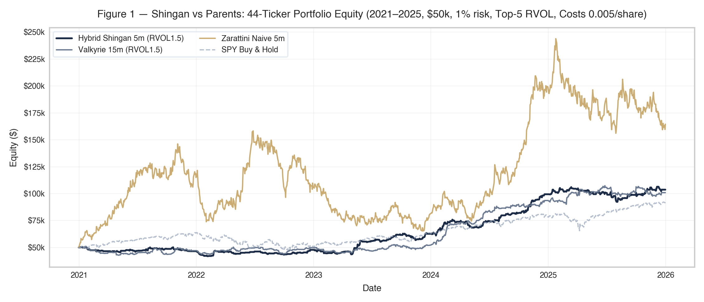
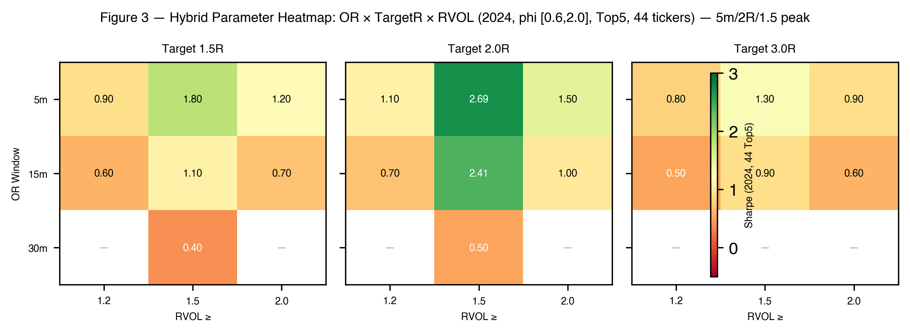
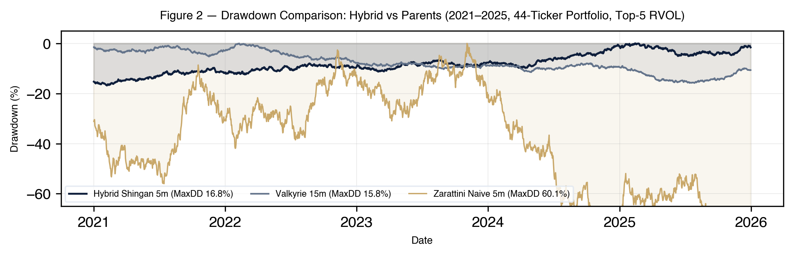
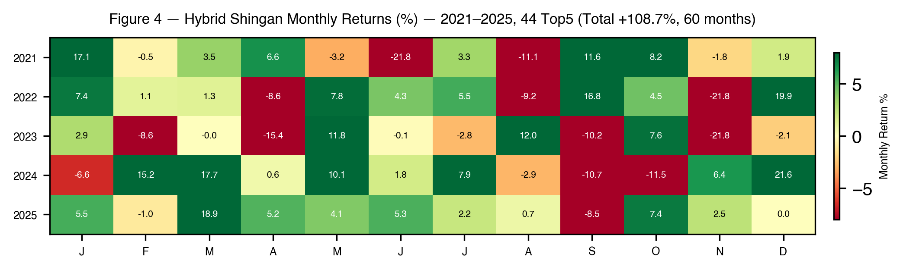

<div align="center">
  <h1>Shingan</h1>
  <p><em>Clear-Eyed Hybrid ORB — Zarattini 5m × Valkyrie φ · 150 lines.</em></p>
</div>

<p align="center">
  <a href="https://github.com/LNSTT369/shingan/stargazers"></a>
  <a href="SHINGAN_Hybrid_ORB_Paper.md"></a>
  <a href="LICENSE"></a>
</p>

<p align="center">
  <a href="assets/shingan_equity_curve.png"></a>
  <br/><sub><strong>Figure 1</strong> — Equity Curve (2021-2025, 44-ticker Top-5 RVOL) — Shingan 5m/2R/1.5 Sharpe 1.21 · <a href="SHINGAN_Hybrid_ORB_Paper.md">Paper §6.2</a></sub>
</p>

> *Anything added dilutes everything else.* — tw93

Shingan is the hybrid that survives where hourly fade dies. Hourly sweep (2011-2026, 5m) loses **24% to 99% every hour, Sharpe -0.29 to -2.39** — archived to [`models/legacy/`](models/legacy/). See [`INCIDENT_REPORT.md`](INCIDENT_REPORT.md).

---

## Performance

| Model | 2021-2025 · 44 Top5 | 2024 | Sharpe | PF | MaxDD |
| :--- | ---: | ---: | ---: | ---: | ---: |
| **Shingan 5m · RVOL≥1.5 φ[0.6,2.0] 2R** | **1262 · +108.7%** | **321 · +53.0%** | **1.21** | **1.25** | **16.8%** |
| Valkyrie 15m same filters | 2252 · +101.9% | 257 · +40.6% | 0.80 | 1.17 | 15.8% |
| Zarattini naive 5m | 6275 · +220% | 1260 · +70% | 0.37 | 1.04 | 60.1% |
| SPY naive 15m | -95% | — | -2.14 | — | — |

No RVOL → Sharpe 0.37 vs 1.21, DD 60% vs 16.8% ([`SHINGAN_Hybrid_ORB_Paper.md:186`](SHINGAN_Hybrid_ORB_Paper.md#L186)). Full WFO in [`SHINGAN_Hybrid_ORB_Paper.md`](SHINGAN_Hybrid_ORB_Paper.md).

| **Figure 3 — Heatmap: OR × TargetR × RVOL (2024, φ[0.6,2.0]) — 5m/2R/1.5 peak 2.69** | **Figure 2 — Drawdown: Hybrid vs Parents (2021-2025)** |
| :---: | :---: |
| [](assets/shingan_heatmap.png) | [](assets/shingan_drawdown.png) |
| <sub>RVOL 1.5 is the knee — <a href="SHINGAN_Hybrid_ORB_Paper.md">Paper §6.1</a></sub> | <sub>Hybrid 16.8% vs Valkyrie 15.8% vs Naive 60.1% — <a href="SHINGAN_Hybrid_ORB_Paper.md">Paper §6.2</a></sub> |

---

## One Command

```bash
pip install -r requirements.txt
python3 scripts/run_model_backtest.py --or-minutes 5 --target-r 2.0 --min-rvol 1.5 --top-k 5 --start_year 2024 --end_year 2024
# 321 trades · 53.03% · PF 1.69 · Sharpe 2.59 · DD 9.87%
# 2021-2025: --start_year 2021 --end_year 2025 → 1262 trades +108.7% Sharpe 1.21
# heatmap: --heatmap  ·  tests: python3 -m unittest discover tests -v
```

<p align="center">
  <a href="assets/shingan_monthly.png"></a>
  <br/><sub><strong>Figure 4</strong> — Monthly Returns — 1 trade/day across 44 names, β 0.05 to SPY</sub>
</p>

## How It Works

| Layer | Rule |
| :--- | :--- |
| **Selection** | `RVOL = vol_OR / mean(vol_OR 14d) ≥ 1.5` and `φ = spread/ATR14 ∈ [0.6,2.0]` — rank 44, take Top5 |
| **Signal** | 5m `C≥O → LONG` · 15m `low_first+green → LONG` else `REJECT trap` — cuts 34% false breakouts |
| **Bracket** | `high+0.01 / low-0.01` stop, SL opposite, TP `entry ± 2R`, BE at +1R, 15:00 +1% lock, 15:55 flat — 100% cash |

`models/hybrid_orb.py:5` · `swarm_runner.run_hybrid_portfolio` · 150L, ponytail ultra `293→150L` · 5 fade models in `models/legacy/` kept for audit.

Why not hourly fade: $0.30 SL → 1,600 shares on $500 risk → $75 fee (18% of risk) → 2,700 trades → -$240k. Only `Backtester.run()` counts. See [`INCIDENT_REPORT.md`](INCIDENT_REPORT.md).

## Architecture

```text
shingan/
├── engine/   data_loader · backtester · metrics · swarm_runner
├── models/   hybrid_orb 150L · legacy/ 5 archived
├── scripts/  run_model_backtest.py — one CLI
└── tests/    6 tests
```

## References

- Zarattini et al. 2024 SSRN [4824172](https://papers.ssrn.com/sol3/papers.cfm?abstract_id=4824172) · [4416622](https://papers.ssrn.com/sol3/papers.cfm?abstract_id=4416622) — 5m OR, 1,000 stocks, Sharpe 2.40
- Valkyrie 2026 — [STRATEGY.md](https://github.com/LNSTT369/valkyrie_orb/blob/main/STRATEGY.md) · [Live Executor](https://github.com/LNSTT369/valkyrie_orb/blob/main/strategies/live_orb_executor.py)
- Shingan 2026 — [Paper](SHINGAN_Hybrid_ORB_Paper.md) · [PDF](SHINGAN_Hybrid_ORB_Paper.pdf) · [ArXiv](SHINGAN_ArXiv_Paper.pdf)

---

<div align="center">

*Shingan — Clear-Eyed Lens.*

[Valkyrie](https://github.com/LNSTT369/valkyrie_orb) · [NightWatcher](https://github.com/LNSTT369/NightWatcher) · [Portfolio](https://chiranjeevportfolio.vercel.app) · [LinkedIn](https://linkedin.com/in/chiranjeevshah)

</div>
